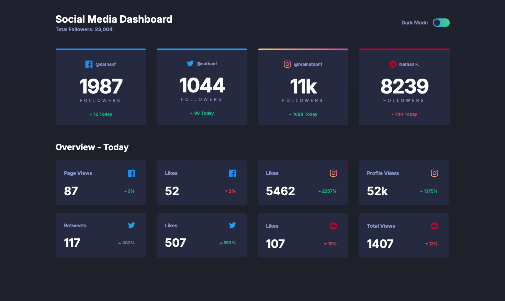

# Social media dashboard with theme switcher solution

This is a solution to the [Social media dashboard with theme switcher challenge on Frontend Mentor](https://www.frontendmentor.io/challenges/social-media-dashboard-with-theme-switcher-6oY8ozp_H). Frontend Mentor challenges help you improve your coding skills by building realistic projects.

## About the Project

_This project was developed during my exploration of React_, focusing on state management for theme switching.

Crafted using **React** with `create-react-app`, **CSS**, and **Scss**, presents a static display of social media statistics with the added feature of switching between dark and light themes, offering users a personalized viewing experience.

## Preview and Links

<b>Open Preview</b>

 

 

| View it live: | [Live Demo URL](https://ionstici.github.io/social-media-dashboard-with-theme-switcher) | [Frontend Mentor](https://www.frontendmentor.io/solutions/social-media-dashboard-with-theme-switcher-ZUPOcJTrbO) |
| ------------- | -------------------------------------------------------------------------------------- | ---------------------------------------------------------------------------------------------------------------- |

## Features

-   **Static Stats Display:** Shows predefined social media statistics in a clean, organized manner.
-   **Theme Switcher:** Allows users to toggle between dark and light themes, enhancing accessibility and user preference.
-   **Responsive Design:** Designed to be responsive, ensuring the dashboard looks good on all devices using CSS and Scss.

## Tech Stack

-   **React:** Initialized with `create-react-app`.
-   **CSS/Scss:** For foundational styling of the dashboard.
